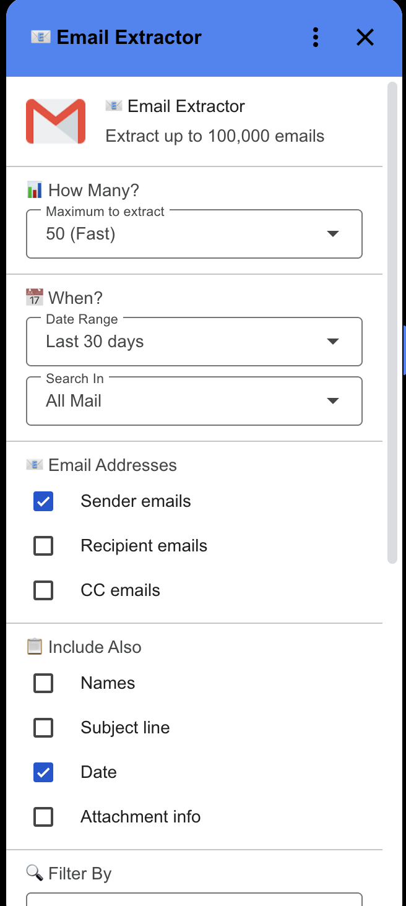
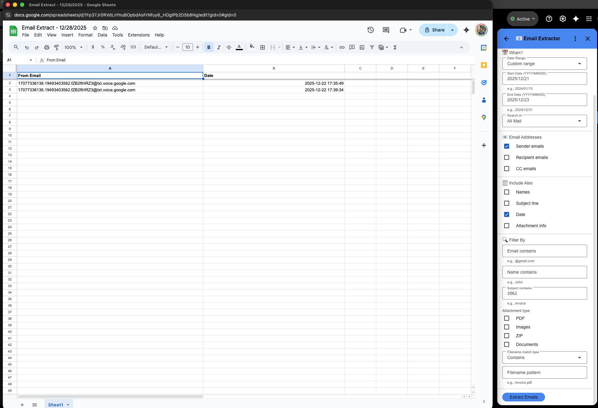

# Email Extractor Library

This project helps developers extract email addresses and message metadata from
Gmail into a clean, structured Google Sheet. It is built as a reusable Apps
Script library with an optional Gmail add-on UI, so teams can automate exports,
audit inboxes, and build lightweight data workflows without standing up servers.

## Usage

This project is free to use. If you plan to customize or extend it, please
fork the repo and use your fork for changes and deployments.

## What This Provides

- A library API for scripted extraction workflows
- A Gmail add-on UI for non-technical users
- Filters for date ranges, subjects, names, attachments, and filenames
- Export control for columns like from/to/cc, subject, date, and attachment info

## Quick Start (Library)

1. Open Google Sheets -> Extensions -> Apps Script
2. Click the plus icon next to Libraries
3. Paste this ID: `YOUR_SCRIPT_ID_HERE`
4. Select version `4` and click Add
5. Use the library in your script:

```javascript
const extractor = EmailExtractor();

function testExtraction() {
  const filters = {
    maxEmails: 200,
    dateRange: "last30days",
    exportFields: ["from", "to", "name", "subject", "date"],
    emailContains: "@gmail.com",
  };

  const result = extractor.extractEmailsWithFilters(filters);

  if (result.success) {
    console.log(`Extracted ${result.extracted} emails`);
    console.log(`Sheet: ${result.sheetUrl}`);
  } else {
    console.error(result.error);
  }
}
```

## Library Link Format

```
https://script.google.com/macros/library/d/SCRIPT_ID/4
```

- `SCRIPT_ID`: your library ID
- `4`: published version

## Gmail Add-on UI

If you deploy as a Gmail add-on, the UI provides checkboxes for export fields,
date range selection (including custom dates), and advanced filters.

## Screenshots

Gmail add-on UI:



Sample export sheet:



## Filters

- `dateRange`: today, yesterday, last7days, last30days, thismonth, lastmonth, custom
- `startDate`, `endDate`: YYYY/MM/DD when using custom range
- `emailFolder`: all, inbox, sent, drafts
- `emailContains`, `nameContains`, `subjectContains`
- `attachmentTypes`: pdf, images, zip, docs
- `filenamePattern` + `filenameMatchType`: contains, startsWith, endsWith
- `deduplicate`: true or false

## Export Fields

Set `exportFields` with any of:

- from, to, cc
- name, subject, date
- hasAttachments, attachmentTypes

## Publishing as a Google Apps Script Library

1. Save the final code in your Apps Script project
2. Deploy -> New deployment -> Select type: Library
3. Version: `4`
4. Description: `Email Extractor v1.0 - Extract emails from Gmail to Sheets`
5. Access: Anyone with link
6. Copy the new library ID and version number

## Examples

```javascript
// Example 1: Extract all emails from last 7 days
extractEmailsWithFilters({
  maxEmails: 1000,
  dateRange: "last7days",
  exportFields: ["from", "subject", "date"],
});

// Example 2: Find all PDF invoices
extractEmailsWithFilters({
  maxEmails: 500,
  dateRange: "last30days",
  exportFields: ["from", "name", "subject"],
  attachmentTypes: ["pdf"],
  subjectContains: "invoice",
});
```

## When to Use This

- Exporting leads or contacts from a mailbox
- Auditing messages by date or subject
- Finding attachments by file type or filename pattern
- Building ad-hoc reports without external tooling

## Limitations

- Apps Script execution limits apply; large runs may time out
- Gmail search syntax and mailbox access control the results
- Each extraction creates a new Google Sheet

## Operational Notes

- Large extractions can time out; start with smaller ranges and batch sizes.
- Gmail search syntax applies; results depend on user mailbox access.
- The script creates a new Google Sheet per extraction.

## License

MIT. See `LICENSE`.
